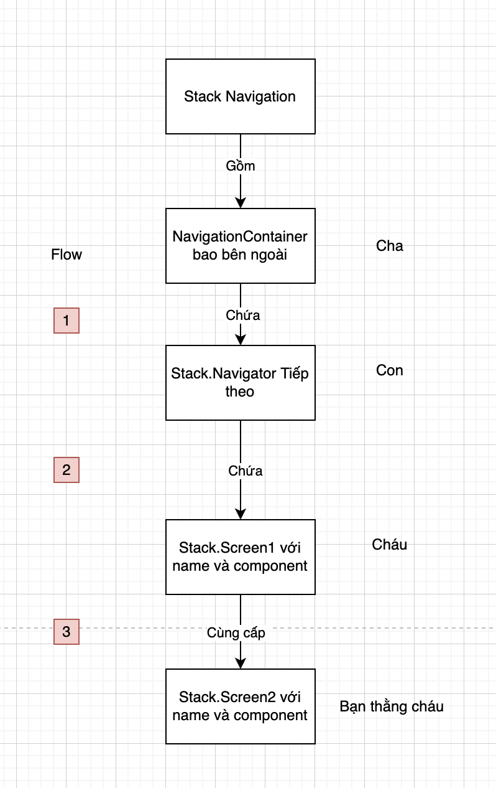
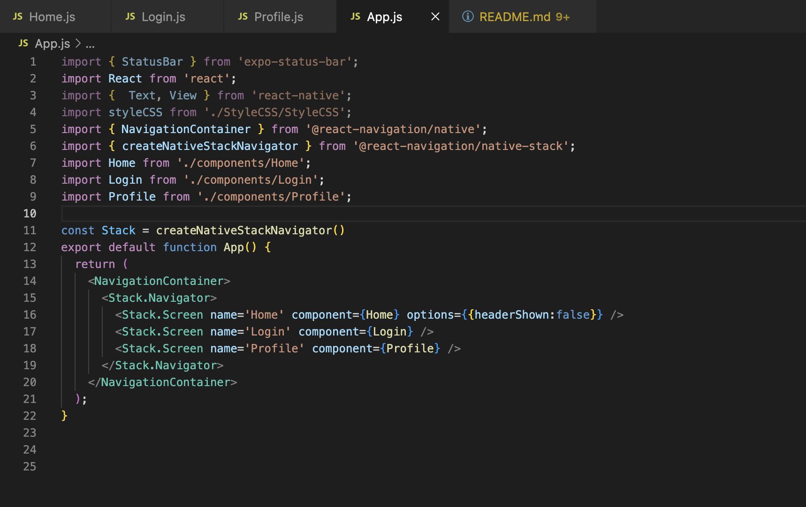
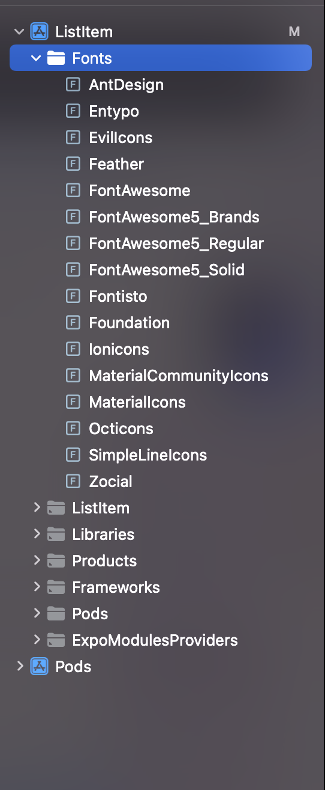
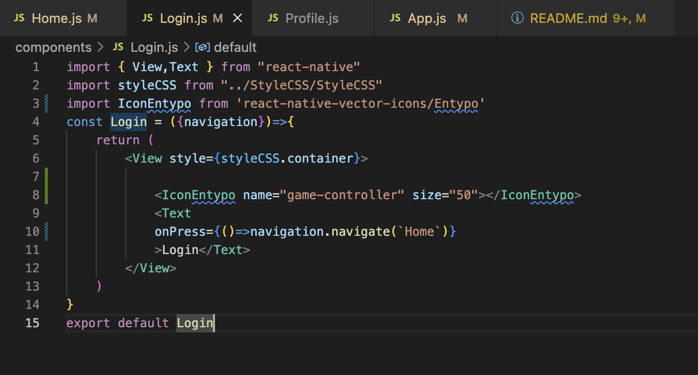

# ListItem

# Step1: Tạo project bằng cách truy cập vào iterm
# Step2: Chọn ReactNative quăng folder vào enter
# Step3: Khởi tạo project ReactNative với 
```
expo init ListItem
```
# Step4: Chuyển qua GithubDesktop rồi up lên github. Ko xài thằng iterm để up vì sẽ lỗi
# Step5: Tạo folder component rồi khởi tạo 3 thằng Home.js,Login.js,Project.js
# Step6: Tạo folder StyleCSS rồi khởi tạo StyleCSS.js rồi export const styleCSS ra

# Step7: Vào file App.js tìm chỗ thuộc tính style.container và gõ lại styleCSS để nó tự import styleCSS vào

# Step8: Tải Navigation Environment từ các link highlight
# Step8.1 Tải các package mà ReactNative yêu cầu từ Native
```
npm install @react-navigation/native
```
Link: https://reactnavigation.org/docs/getting-started#:~:text=npm%20install%20%40react%2Dnavigation/native
# Step8.2 Tải các library hỗ trợ screens và safe area của ios thông qua lệnh

```
expo install react-native-screens react-native-safe-area-context
```
Link: https://reactnavigation.org/docs/getting-started#:~:text=expo%20install%20react%2Dnative%2Dscreens%20react%2Dnative%2Dsafe%2Darea%2Dcontext
# Step8.3 Chạy lệnh dưới để cài Stack Navigation
```
npm install @react-navigation/native-stack
```
Link: https://reactnavigation.org/docs/hello-react-navigation#:~:text=npm%20install%20%40react%2Dnavigation/native%2Dstack
# Step8.4 Cần import  NavigationContainer và createNavigationStackNavigator để sử dụng được. Rất quan trọng 
# Đây là bước sử lý đầu tiên ở trong file 


```
import { NavigationContainer } from '@react-navigation/native';
import { createNativeStackNavigator } from '@react-navigation/native-stack';
```
# Step8.5 Muốn xếp các Screen vào Stack của Navigation thì cần có các Screen. Đi khởi tạo screen
```
import { View,Text } from "react-native"
import styleCSS from "../StyleCSS/StyleCSS"

const Home = ()=>{
    return (
        <View style={styleCSS.container}>
            <Text>Home</Text>
        </View>
    )
}
export default Home
```
```
import { View,Text } from "react-native"
import styleCSS from "../StyleCSS/StyleCSS"

const Login = ()=>{
    return (
        <View style={styleCSS.container}>
            <Text>Login</Text>
        </View>
    )
}
export default Login
```
```
import { View,Text } from "react-native"
import styleCSS from "../StyleCSS/StyleCSS"

const Profile = ()=>{
    return (
        <View style={styleCSS.container}>
            <Text>Profile</Text>
        </View>
    )
}
export default Profile
```
# Flow của Navigation qua mô hình 

# Flow qua code

```
import { StatusBar } from 'expo-status-bar';
import React from 'react';
import {  Text, View } from 'react-native';
import styleCSS from './StyleCSS/StyleCSS';
import { NavigationContainer } from '@react-navigation/native';
import { createNativeStackNavigator } from '@react-navigation/native-stack';
import Home from './components/Home';
import Login from './components/Login';
import Profile from './components/Profile';

const Stack = createNativeStackNavigator()
export default function App() {
  return (
    <NavigationContainer>
      <Stack.Navigator>
        <Stack.Screen name='Home' component={Home} options={{headerShown:false}} />
        <Stack.Screen name='Login' component={Login} />
        <Stack.Screen name='Profile' component={Profile} />
      </Stack.Navigator>
    </NavigationContainer>
  );
}

```
```
options={{headerShown:false}} 
```
headerShown để ẩn title của các Stack trong navigation bar
# Step8.6 Click vào view để điều hướng với Stack
Trong () của 1 component sử dụng JSX truyền vào 1 props tên là navigation của NavigationContainer để điều hướng


Link các thuộc tính của navigation: https://reactnavigation.org/docs/navigation-prop#:~:text=The%20functions%20are%3A-,navigation,-replace%20%2D%20replace%20the
```
import { View,Text } from "react-native"
import styleCSS from "../StyleCSS/StyleCSS"

const Login = ({navigation})=>{
    return (
        <View style={styleCSS.container}>
            <Text
            onPress={()=>navigation.navigate(`Profile`)}
            >Login</Text>
        </View>
    )
}
export default Login
```
# Step8.7 Nesting avigators (Click từ Login nằm trong Stack Navigation chuyển đến 1 Stack khác mà Stack này có chứa Tab Navigator) -> Chưa làm, cần học
Link: https://reactnavigation.org/docs/nesting-navigators#:~:text=Version%3A%206.x-,Nesting%20navigators,-Nesting%20navigators%20means
# Step8.8 Cách sử dụng vector icon
Link : https://www.npmjs.com/package/react-native-vector-icons
# Step8.8.1 Cài đặt package
```
npm i react-native-vector-icons
```
# Step8.8.2 Click vào link để cài đặt: 
https://www.npmjs.com/package/react-native-vector-icons#:~:text=Homepage-,github.com/oblador/react%2Dnative%2Dvector%2Dicons,-Weekly%20Downloads
# Step8.8.3 Do thằng ios nó cần cài đặt Info.plist Fonts nên sẽ mở Xcode workspace của dự án -> Tạo NewGroup Fonts 
# Step8.8.4 Vô phần node_modules/react_native_vector_icons rồi tìm Fonts -> Reveal in Finder -> copy hết kéo sang Fonts của Xcode workspace

# Step8.8.5 Chọn Info.plist rồi Chọn Fonts provided by application -> add hết bằng cách copy paste từng file 
# Step8.8.6 Về lại iterm cd tới ios Chạy lệnh:
```
pod install
```
# Step8.8.7 Về lại file muốn cài icon
Search react-native-vector-icons directory 


Search name của icon muốn add vào -> Chú ý name này là name của property name 


Mục mà nó hiển thị mình đặt tên là Icon + tên của mục. 

```
import { View,Text } from "react-native"
import styleCSS from "../StyleCSS/StyleCSS"
import IconEntypo from 'react-native-vector-icons/Entypo'
const Login = ({navigation})=>{
    return (
        <View style={styleCSS.container}>

            <IconEntypo name="game-controller" size="50"></IconEntypo>
            <Text
            onPress={()=>navigation.navigate(`Home`)}
            >Login</Text>
        </View>
    )
}
export default Login
```


