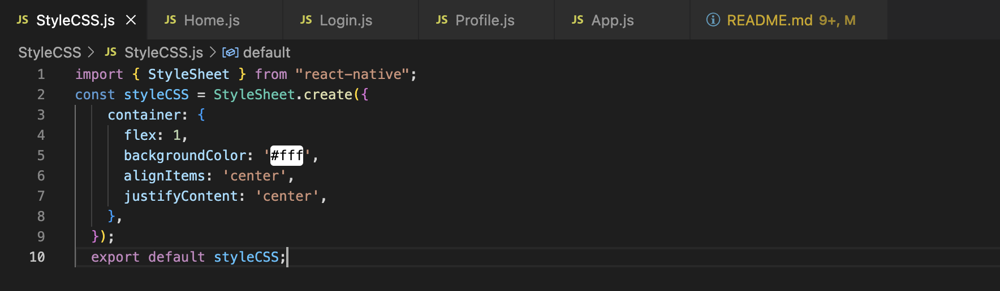
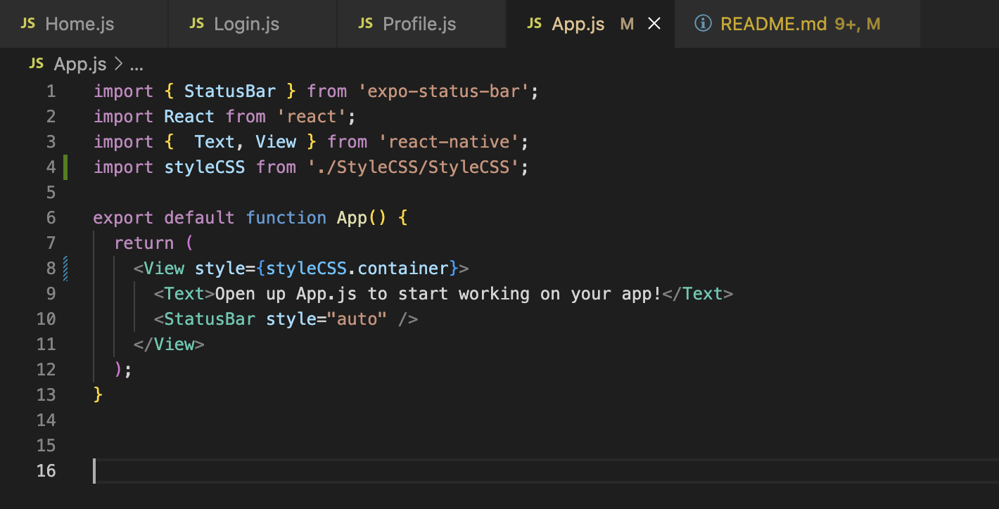

# ListItem

# Step1: Tạo project bằng cách truy cập vào iterm
# Step2: Chọn ReactNative quăng folder vào enter
# Step3: Khởi tạo project ReactNative với 
```
expo init ListItem
```
# Step4: Chuyển qua GithubDesktop rồi up lên github. Ko xài thằng iterm để up vì sẽ lỗi
# Step5: Tạo folder component rồi khởi tạo 3 thằng Home.js,Login.js,Project.js
# Step6: Tạo folder StyleCSS rồi khởi tạo StyleCSS.js rồi export const styleCSS ra

# Step7: Vào file App.js tìm chỗ thuộc tính style.container và gõ lại styleCSS để nó tự import styleCSS vào

# Step8: Tải Navigation Environment từ link highlight
# Step8.1 Tải các package mà ReactNative yêu cầu từ Native
```
npm install @react-navigation/native
```
https://reactnavigation.org/docs/getting-started#:~:text=npm%20install%20%40react%2Dnavigation/native
# Step8.2 Tải các library hỗ trợ screens và safe area của ios thông qua lệnh

```
expo install react-native-screens react-native-safe-area-context
```
https://reactnavigation.org/docs/getting-started#:~:text=expo%20install%20react%2Dnative%2Dscreens%20react%2Dnative%2Dsafe%2Darea%2Dcontext

Chạy lệnh dưới để cài Stack Navigation
```
npm install @react-navigation/native-stack
```
