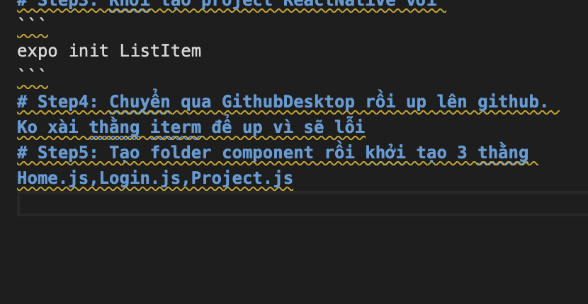

# ListItem

# Step1: Tạo project bằng cách truy cập vào iterm
# Step2: Chọn ReactNative quăng folder vào enter
# Step3: Khởi tạo project ReactNative với 
```
expo init ListItem
```
# Step4: Chuyển qua GithubDesktop rồi up lên github. Ko xài thằng iterm để up vì sẽ lỗi
# Step5: Tạo folder component rồi khởi tạo 3 thằng Home.js,Login.js,Project.js
